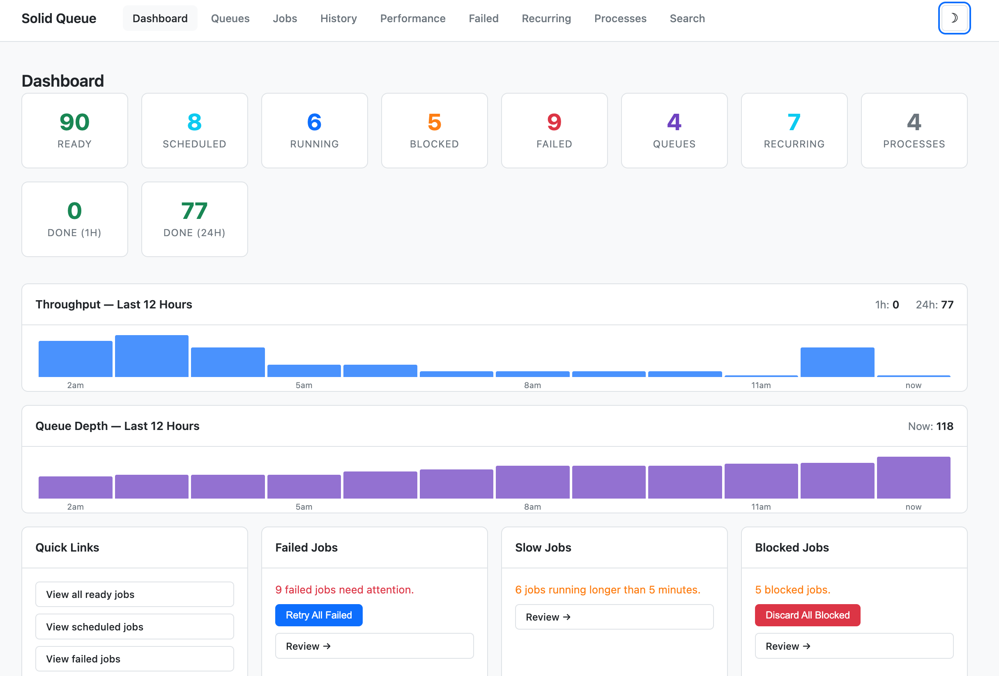

# SolidQueueWeb

[](https://github.com/eclectic-coding/solid_queue_web/actions/workflows/ci.yml)
[](https://rubygems.org/gems/solid_queue_web)
[](https://rubygems.org/gems/solid_queue_web)
[](https://rubygems.org/gems/solid_queue_web)
[](https://codecov.io/gh/eclectic-coding/solid_queue_web)

A monitoring and management dashboard for [Solid Queue](https://github.com/rails/solid_queue), mountable as a Rails engine in any app.

## The problem

Solid Queue ships without a web interface. When jobs fail, queues back up, or workers go silent in production, the only options are `rails console` or raw SQL queries. SolidQueueWeb gives your team a real-time dashboard to inspect, retry, and discard jobs without leaving the browser — and without standing up any additional infrastructure.

## Why SolidQueueWeb?

- Purpose-built for Solid Queue — uses its native models directly, no adapters
- No external CSS framework — drops into any Rails app without asset conflicts
- Zero-config to start — one line in `routes.rb` and you're running
- Built for Rails 8 — Turbo Frames for in-place updates, Stimulus for dynamic search and auto-refresh, Pagy for efficient pagination
- Inspired by Sidekiq Web UI and the GoodJob dashboard, adapted for the Solid Queue ecosystem

## Real-world use case

A Rails app processes order confirmations, email notifications, and report generation through Solid Queue. An operations team needs to:

- Monitor queue depth before a high-traffic event
- Retry a batch of failed notification jobs after a third-party API outage
- Pause a queue while a fix is being deployed
- Identify blocked or long-running jobs before they impact users

SolidQueueWeb surfaces all of this in a browser UI available at any route you choose.

## Features

- **Dashboard** — stat cards showing counts for ready, scheduled, running, blocked, and failed jobs, plus queues, recurring tasks, and processes; "Done (1h)" and "Done (24h)" throughput cards; a "Throughput — Last 12 Hours" bar chart showing completed-job counts per hour (pure CSS, no charting library); auto-refreshes every 5 seconds
- **Queues** — all queues sorted by name with size; oldest ready job latency (color-coded, with UTC timestamp tooltip); Done (24h) and Failed (24h) throughput counts; pause/resume controls
- **Jobs** — filterable by status (ready, scheduled, claimed, blocked, failed) and by queue; search by job class name with dynamic auto-submit; time-based period filter (1 h / 24 h / 7 d); discard individual or all jobs; Turbo Frame navigation so only the table updates on filter or search; auto-refreshes every 10 seconds
- **Failed jobs** — list of failed executions with error details; search by class name; filter by queue; time-based period filter; retry or discard individually or in bulk
- **Job detail** — full arguments, timestamps, blocked-until date, and error backtrace; action buttons based on job status
- **Queue management** — pause and resume individual queues; queue-scoped job list with status filter, search, and discard
- **Recurring tasks** — all configured recurring tasks with cron schedule, next run time, last run time, and static/dynamic classification
- **Processes** — workers, dispatchers, and supervisors with heartbeat health status; auto-refreshes every 10 seconds
- **Global search** — search across all job statuses at once by class name substring; results grouped by status with match count and direct links to filtered views; native datalist autocomplete pre-populated from all known job classes; auto-submits on selection
- **Targeted bulk actions** — checkboxes on the jobs and failed jobs lists for selecting individual rows; selection bar shows count and action buttons ("Discard Selected" for jobs, "Retry Selected" / "Discard Selected" for failed jobs); select-all checkbox in the table header
- **Job history** — browsable list of all finished jobs with class name, queue, duration, and finished timestamp; filterable by period (1h / 24h / 7d), queue, and class name search; Done (1h) / Done (24h) dashboard cards link directly to the filtered history view; auto-refreshes every 10 seconds
- **Dark mode** — ☽/☀ toggle in the header; preference persists to `localStorage` and defaults to the OS `prefers-color-scheme` on first visit; zero extra dependencies — implemented via CSS custom properties and a small Stimulus controller
- **Dashboard quick actions** — "Retry All Failed" and "Discard All Blocked" cards appear on the dashboard only when the respective count is non-zero; one-click bulk operations with confirm dialogs, keeping the dashboard clean when everything is healthy
- **CSV export** — "Export CSV" button on the jobs, failed jobs, and history pages downloads all records matching the current filters; columns are tailored per view

## Screenshots



## Compatibility

| Dependency  | Version    |
|-------------|------------|
| Ruby        | >= 3.3     |
| Rails       | >= 8.1.3   |
| Solid Queue | >= 1.0     |

Tested on Ruby 3.3, 3.4, and 4.0.

## Installation

Add to your application's Gemfile:

```ruby
gem "solid_queue_web"
```

Then run:

```bash
bundle install
```

## Mounting the engine

Add to your `config/routes.rb`:

```ruby
mount SolidQueueWeb::Engine, at: "/jobs"
```

The dashboard will be available at `/jobs`.

## Configuration

All settings are optional — the dashboard works with zero configuration. Create `config/initializers/solid_queue_web.rb` to customize behavior:

```ruby
SolidQueueWeb.configure do |config|
  config.page_size                  = 50     # rows per page across all paginated views (default: 25)
  config.dashboard_refresh_interval = 10_000 # dashboard auto-refresh in ms (default: 5_000)
  config.default_refresh_interval   = 30_000 # jobs/processes/history auto-refresh in ms (default: 10_000)
  config.search_results_limit       = 10     # max results per status in global search (default: 25)
end

SolidQueueWeb.authenticate do
  # Called in the context of ApplicationController — use any helper available there.
  # Return a truthy value to allow access, falsy to deny (triggers HTTP Basic prompt).
  current_user&.admin?
end
```

No authentication is enforced by default. When the `authenticate` block returns falsy, HTTP Basic auth is used as a fallback.

## Roadmap

Planned features, roughly ordered by priority:

**Larger scope**
- Webhook / alert config — POST to a URL when the failure count exceeds a threshold

Pull requests for any of these are welcome. See [Contributing](#contributing) below.

## Contributing

Bug reports and pull requests are welcome on [GitHub](https://github.com/eclectic-coding/solid_queue_web).

## License

The gem is available as open source under the terms of the [MIT License](https://opensource.org/licenses/MIT).